
<a href="https://virus-momentx.github.io/wiki-virus-swords/">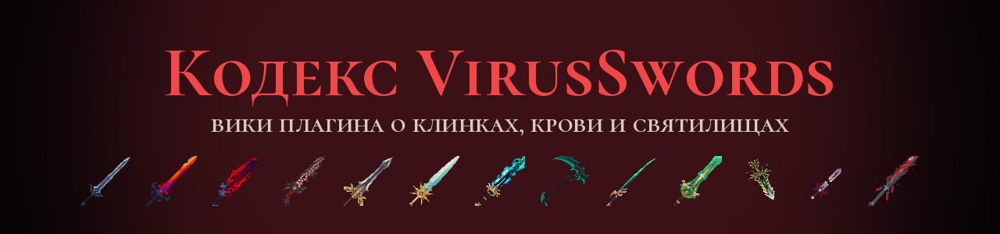</a>

  <a href="https://virus-momentx.github.io/wiki-virus-swords/"><b>Открыть вики →</b></a>

  
  
  
  
  

**VirusSwords** — плагин для Minecraft о клинках, которые выбирают своих хозяев. 30 клинков со своими моделями и способностями, шесть родословных, святилища со стражами и боссами, Проклятый замок на крыше Незера и сюжет, который ведут Путеводитель и Наблюдатель.

Это репозиторий **Кодекса** — вики плагина. Всё, что нужно игроку, — на сайте:
**[virus-momentx.github.io/wiki-virus-swords](https://virus-momentx.github.io/wiki-virus-swords/)**

## Что в вики

| Раздел | О чём |
|---|---|
| [С чего начать](https://virus-momentx.github.io/wiki-virus-swords/#start) | первые шаги: выбор крови, компасы, первый клинок |
| [Редкости](https://virus-momentx.github.io/wiki-virus-swords/#rarity) | от обычной до ультра-адской, с переливами названий |
| [Оружие](https://virus-momentx.github.io/wiki-virus-swords/#weapons) | все клинки: урон, способности, где взять |
| [Материалы](https://virus-momentx.github.io/wiki-virus-swords/#materials) | души, сердца, сущности, осколки и Тессеракт |
| [Рост клинка](https://virus-momentx.github.io/wiki-virus-swords/#growth) | мастерство, заточка до ★5 и пробуждение |
| [Святилища](https://virus-momentx.github.io/wiki-virus-swords/#sanctums) | храмы, их стража, боссы, Проклятый замок и Терра-подземелье |
| [Испытания](https://virus-momentx.github.io/wiki-virus-swords/#raids) | пять волн святилища, уровни и награды |
| [Родословные](https://virus-momentx.github.io/wiki-virus-swords/#blood) | шесть кровей, четыре формы, крылья |
| [Достижения](https://virus-momentx.github.io/wiki-virus-swords/#trophies) | все достижения и как их получить |
| [Для администратора](https://virus-momentx.github.io/wiki-virus-swords/#admin) | установка, ресурспак и настройки |

## Клинки

Клинки собраны в линии: каждый следующий вырастает из предыдущего или куётся в святилище. Полные способности и рецепты — в разделе [«Оружие»](https://virus-momentx.github.io/wiki-virus-swords/#weapons).

### Адская линия

| | Клинок | Урон | Редкость | Где взять |
|---|---|---|---|---|
| 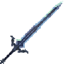 | **Погибель** | 7 | Обычная | Сундуки древнего города |
| 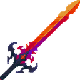 | **Бедствие** | 9 | Адская | Крафт: Погибель + Душа демона |
| 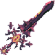 | **Воля Демона** | 11 | Адская | Крафт из Бедствия или эволюция в Незеритовой кузне |
| 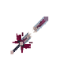 | **Империум** | 14 | Ультра-адская | Ковка в Незеритовой кузне: Воля Демона, Сердце кузни, 64 осколка души |

### Резаки

| | Клинок | Урон | Редкость | Где взять |
|---|---|---|---|---|
| 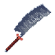 | **Резак** | 5 | Обычная | Сундуки древнего города |
| 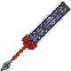 | **Демонический резак** | 7 | Эпическая | Крафт: Резак + Душа демона |
| 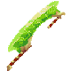 | **Терра-резак** | 10 | Терра | Крафт из Демонического резака и терра-слитков |

### Кровавая линия

| | Клинок | Урон | Редкость | Где взять |
|---|---|---|---|---|
| 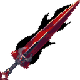 | **Арахнид** | 8 | Необычная | Сундуки заброшенной шахты |
| 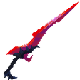 | **Убийца демонов** | 10 | Адская | Крафт: Арахнид + Душа демона |
| 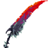 | **Рассекатель могил** | 11 | Адская | Эволюция Убийцы демонов в Незеритовой кузне |
| 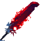 | **Люцифер** | 14 | Супер-адская | Эволюция Рассекателя могил в Незеритовой кузне |

### Секиры

| | Клинок | Урон | Редкость | Где взять |
|---|---|---|---|---|
| 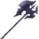 | **Сумрачная секира** | 10 | Необычная | Сундуки крепости Незера |
| 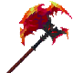 | **Секира берсерка** | 13 | Адская | Сумрачная секира меняется сама в испытании Незеритовой кузни |
| 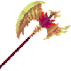 | **Золотой феникс** | 14 | Небесная | Сумрачная секира меняется сама в испытании Небесного храма |

### Небесные клинки

| | Клинок | Урон | Редкость | Где взять |
|---|---|---|---|---|
| 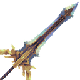 | **Hyperion** | 14 | Небесная | Ковка в Небесном храме |
| 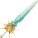 | **Солнцестояние** | 13 | Небесная | Ковка в Небесном храме, днём |
| 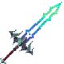 | **Призрачный страж** | 12 | Небесная | Сокровищница Проклятого замка |
| 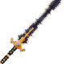 | **Экскалибур** | 12 | Небесная | Ковка в Небесном храме, днём |

### Небесная ночь

| | Клинок | Урон | Редкость | Где взять |
|---|---|---|---|---|
| 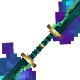 | **Звёздная грань** | 13 | Небесная | Ковка в Тёмном храме, в полнолуние |
|  | **Солнцестояние** | 13 | Небесная | Ковка в Небесном храме, днём |
| 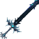 | **Ночная фурия** | 13 | Небесная | Ковка в Тёмном храме или эволюция Солнцестояния |
| 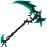 | **Реквием девятого неба** | 15 | Небесная | Эволюция Ночной фурии в Тёмном храме |
|  | **Экскалибур** | 12 | Небесная | Ковка в Небесном храме, днём |
| 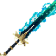 | **Истинный Экскалибур** | 16 | Небесная | Ковка в Тёмном храме: Экскалибур и Звёздная грань |

### Ковка в джунглях

| | Клинок | Урон | Редкость | Где взять |
|---|---|---|---|---|
| 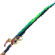 | **Терра-блейд** | 12 | Терра | Ковка в Храме джунглей |
| 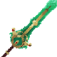 | **Энигма** | 13 | Терра | Ковка в Храме джунглей |
| 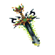 | **Селестиал** | 15 | Терра | Эволюция Энигмы в Храме джунглей, 4-я форма крови предков |

### Терра-подземелье

| | Клинок | Урон | Редкость | Где взять |
|---|---|---|---|---|
| 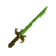 | **Древний** | 11 | Терра | Бочки Терра-подземелья |

### Техноорганическая кровь

| | Клинок | Урон | Редкость | Где взять |
|---|---|---|---|---|
| 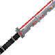 | **Энцефало-меч** | 10 | Техно | Дар Древней фабрики вместе с техноорганической кровью |
| 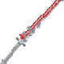 | **Энцефало-клинок** | 12 | Техно | Сам вырастает из Энцефало-меча |
| 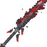 | **Энцефало-истребитель** | 14 | Техно | Сам вырастает из Энцефало-клинка |

### Бездна: корона своей крови + Чёрная субстанция

| | Клинок | Урон | Редкость | Где взять |
|---|---|---|---|---|
|  | **Люцифер** | 14 | Супер-адская | Эволюция Рассекателя могил в Незеритовой кузне |
|  | **Селестиал** | 15 | Терра | Эволюция Энигмы в Храме джунглей, 4-я форма крови предков |
|  | **Истинный Экскалибур** | 16 | Небесная | Ковка в Тёмном храме: Экскалибур и Звёздная грань |
|  | **Энцефало-истребитель** | 14 | Техно | Сам вырастает из Энцефало-клинка |
| 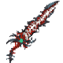 | **Все-Чёрный** | 14 | Ультра-адская | Эволюция короны крови с Чёрной субстанцией у алтаря своего храма |

## Родословные

При первом входе игрок выбирает кровь. Она растёт до четвёртой формы и решает, какие клинки ему служат. Подробно — в разделе [«Родословные»](https://virus-momentx.github.io/wiki-virus-swords/#blood).

| Кровь | Святилище | Девиз |
|---|---|---|
| **Пепельная кровь** | Незеритовая кузня | Кровь горнов Преисподней. Огонь ей родня, Незер — дом. |
| **Небесная кровь** | Небесный храм | Кровь тех, кто первым поднялся к облакам. Земля ей тесна. |
| **Ночная небесная кровь** | Тёмный храм | Небо, отданное ночи. Звёзды ей ближе солнца. |
| **Кровь бездны** | Незеритовая кузня | Кровь, что видит в темноте. Ночь ей мать, тень — укрытие. |
| **Кровь предков** | Храм джунглей | Кровь тех, кто стоял в строю до последнего. Её не сдвинуть. |
| **Техноорганическая кровь** | Древняя фабрика | В ней течёт ток. Металл ей родня. |

## Святилища и боссы

| Где | Как найти | Босс |
|---|---|---|
| **Незеритовая кузня** | в толще незерака | Горнило, кузнец Преисподней |
| **Небесный храм** | над облаками, на высоте 200 | Серафим Падшего Рассвета |
| **Храм джунглей** | ступенчатая пирамида в джунглях | Древний страж джунглей |
| **Древняя фабрика** | глубоко под землёй | Предвестник |
| **Тёмный храм** | встаёт только ночью | Пустотный Серафим |
| **Проклятый замок** | на крыше Незера | Проклятый король |
| **Терра-подземелье** | под джунглями, появляется и исчезает | Джунглевый голем |

Ещё в вики: 22 материалов, 37 достижений, испытания святилищ и рост клинка до пробуждения.

## Как устроен репозиторий

| Путь | Что там |
|---|---|
| `index.html` | страница вики: только каркас, всё остальное подключается из папок ниже |
| `scripts/wiki.js` | код вики: разделы, поиск, карточки, подсказки |
| `scripts/data.js` | все данные вики — клинки, материалы, родословные, достижения — обычным списком полей |
| `scripts/vue.js` | библиотека Vue, на которой собрана вики (чужой код, не правится) |
| `styles/index.css` | оформление |
| `images/` | картинки: `icons/` — предметы, `places/` — святилища, `guide/` и `other/` — остальное |
| `assets/` | баннер и иконки для этой страницы |
| `.nojekyll` | говорит GitHub Pages отдавать файлы как есть |

Файлы собираются автоматически из исходников плагина, поэтому руками их не правят: каждое обновление плагина пересобирает вики и кладёт сюда новые версии. Сайт публикуется через GitHub Pages: **Settings → Pages → Deploy from a branch → `main` / `(root)`**.

## Благодарности

Модели оружия — ресурспаки Fantasy Weapons (автор nongkos), Blades of Majestica и Ancient Elements.
